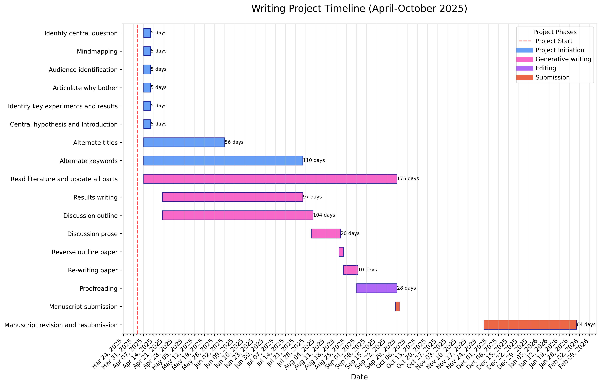

# Gantt chart timeline for a single writing project via matplotlib in Python

## Problem addressed

Gantt charts help keep you realistic about your planning.
They are valuable for planning large, complex projects and managing multiple projects.
However, finding open-source software to make timelines is a pain.
The plan below is for one writing one manuscript. 
 It can accompany a writing log used to manage the writing project.

  

## Instructions
 1. Edit the path to your Python binary.
 2. Install missing modules with pip.
 3. Relabel the activities in the named tuple to customize.
 4. Edit the start and end dates of each activity of a writing project in the named tuple to suit.
 5. Add or remove categories of phases if desired.
 7. Change the colors to suit.
 8. Edit the title to suit.
 9. Run `chmod +x writingLogGnatt.py`.
 10. Run the script: `./writingLogGnatt.py`.
 11. The resulting image will be displayed and written to a PNG file.

See  [[Gantt chart for multiple projects](https://github.com/MooersLab/gantt-chart-py)].

## Update history

|Version      | Changes                                                                                                                                                                         | Date                 |
|:-----------|:------------------------------------------------------------------------------------------------------------------------------------------|:--------------------|
| Version 0.1 |   Added badges, funding, and update table.  Initial commit.                                                                                                                | 2025 April 4 |

## Sources of funding

- NIH: R01 CA242845
- NIH: R01 AI088011
- NIH: P30 CA225520 (PI: R. Mannel)
- NIH: P20 GM103640 and P30 GM145423 (PI: A. West)
